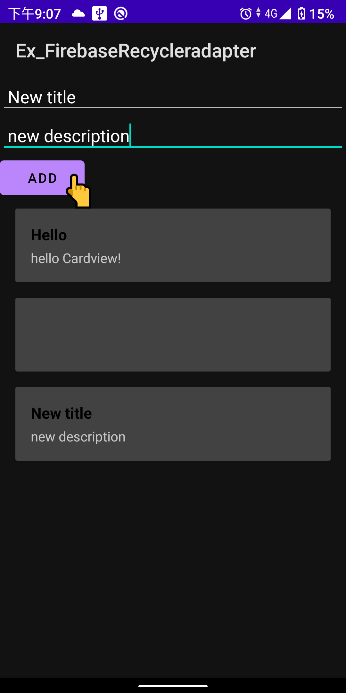
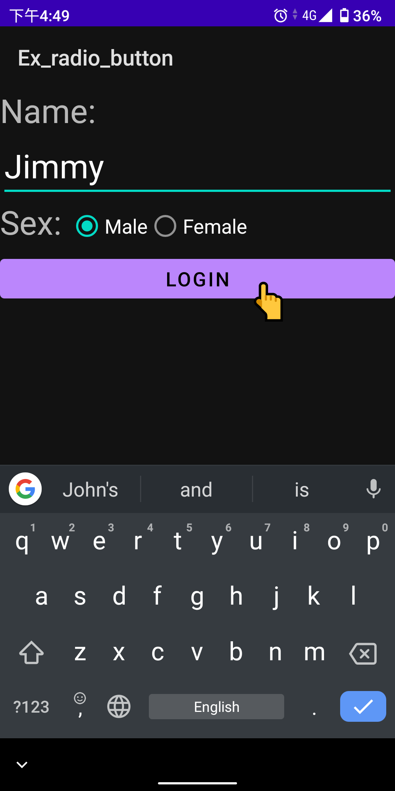
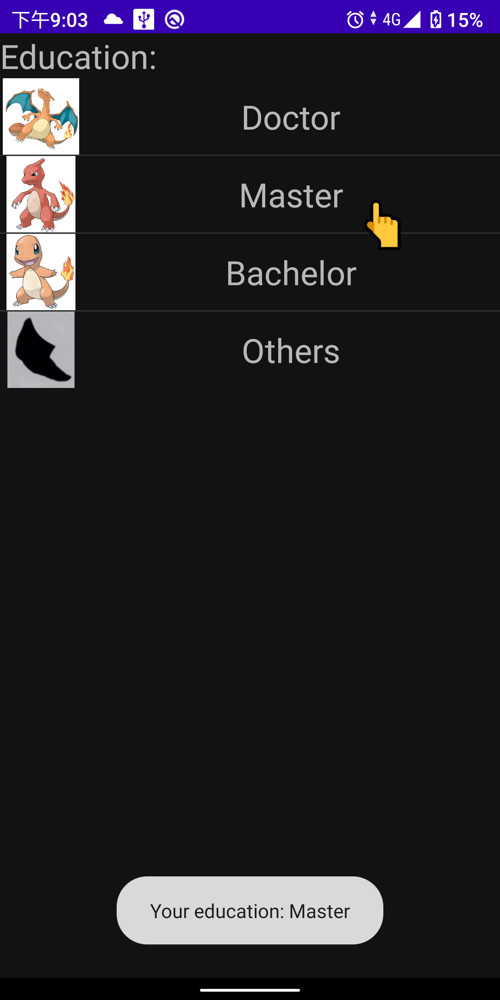

# Android-note
Collecting exercsies and [study notes](/Android_study_notes.md) that I made in one week.

 

Demo looks
-

Exercises to build FirebaseRecyclerView, Radio Button, and custom ListView.
 
 

 &nbsp;&nbsp;&nbsp;&nbsp;&nbsp;&nbsp;&nbsp;&nbsp;&nbsp;&nbsp;&nbsp;&nbsp;&nbsp;&nbsp;&nbsp;    &nbsp;&nbsp;&nbsp;&nbsp;&nbsp;&nbsp;&nbsp;&nbsp;&nbsp;&nbsp;&nbsp;&nbsp;&nbsp;&nbsp;&nbsp; 

 
 

**Contents of study notes**
===

<!-- vim-markdown-toc GFM -->

* [Basic Concept](/Android_study_notes.md#Basic-Concept)
    * [AndroidManifest.xml](/Android_study_notes.md#AndroidManifest.xml)
    * [Build.gradle](/Android_study_notes.md#Build.gradle)
    * [Activity lifecycle managing](/Android_study_notes.md#Activity-lifecycle-managing)
* [First app building](/Android_study_notes.md#First-app-building)
    * [Building Steps](/Android_study_notes.md#Building-Steps)
    * [Intent-filter](/Android_study_notes.md#Intent-filter)

* [User Interface](/Android_study_notes.md#User-Interface)
    * [LinearLayout](/Android_study_notes.md#LinearLayout)
    * [Button](/Android_study_notes.md#Button)
    * [Intent](/Android_study_notes.md#Intent)
    * [Adapter](/Android_study_notes.md#Adapter)
    * [ListView](/Android_study_notes.md#ListView)
    * [RecyclerView](/Android_study_notes.md#RecyclerView)
* [Exercises](/Android_study_notes.md#Exercises)
* [Useful links for Development](/Android_study_notes.md#Useful-links-for-Development)

<!-- vim-markdown-toc -->
